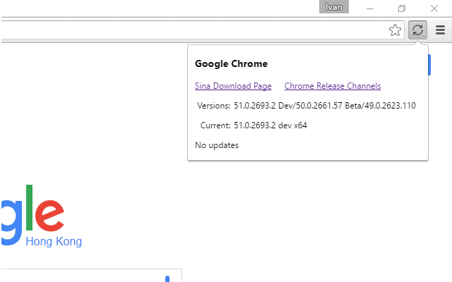

# crx-chrome-sina

> Google Chrome extension to check for Chrome updates from Sina download site.

In China mainland proxy is required to install or update Google Chrome.
One solution is download Chrome installer from the software download site,
just as this extension does.

Notice: it's recommended that normal users use software manager,
e.g. 应用宝, to install Chrome,
and it will automatically install the updates for you.

Install extension from [Google Web Store](https://chrome.google.com/webstore/detail/chrome-update/idnfdnijojifmkhgmhoheahenfohidlc)

## License

MIT (c) Ivan Yan
